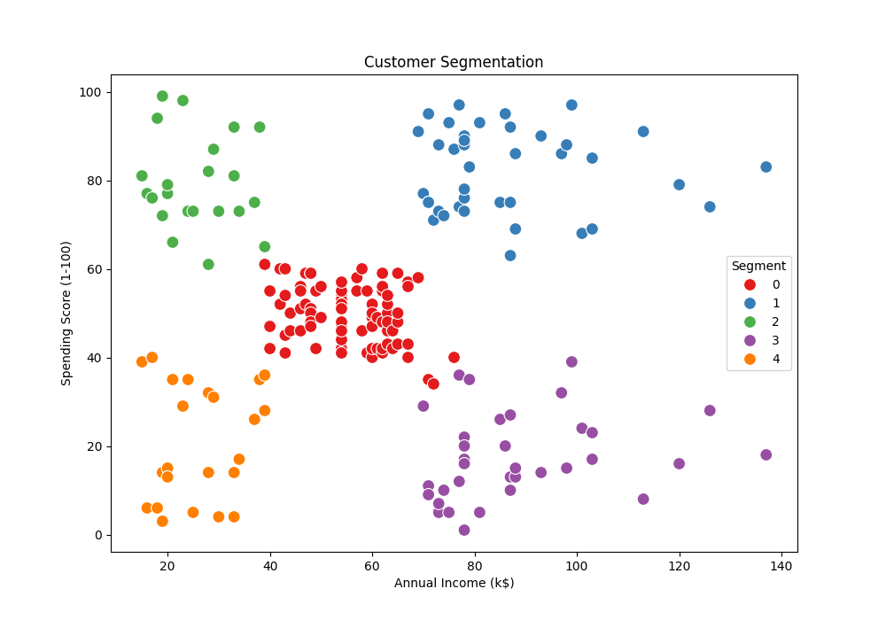
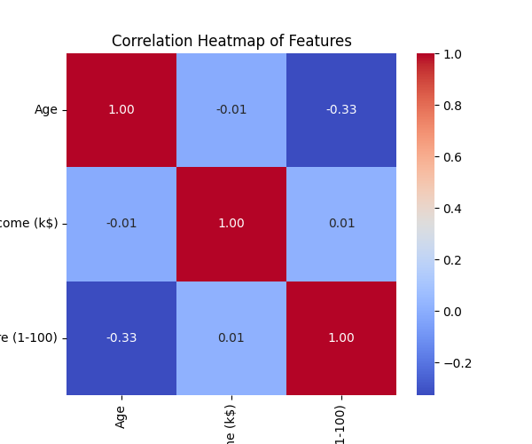
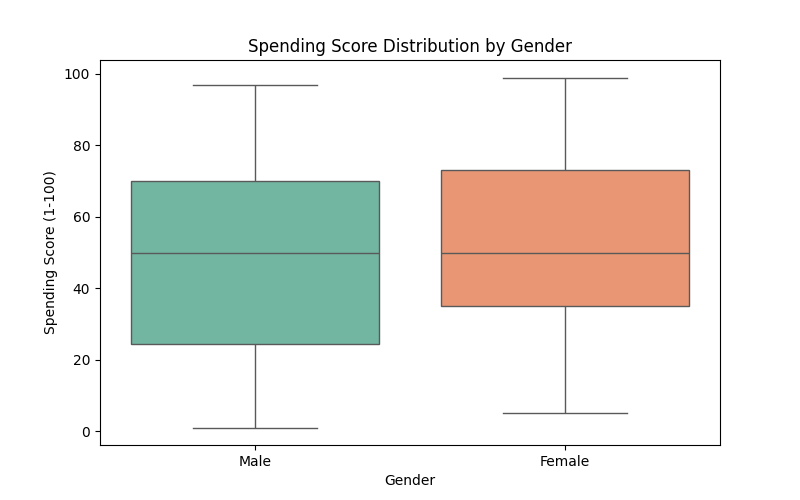

# Task 2 – Customer Segmentation Analysis

## Project Description
This project performs customer segmentation analysis for an e-commerce company using the Mall_Customers dataset. The goal is to group customers into distinct segments based on their purchasing behavior and spending patterns. These insights help in targeted marketing, improving customer satisfaction, and enhancing business strategies.

---

## Dataset
- **Source:** Mall_Customers.csv
- **Columns:**
  - CustomerID
  - Gender
  - Age
  - Annual Income (k$)
  - Spending Score (1-100)

---

## Key Steps Performed

### 1. Data Exploration
- Checked dataset structure, types, and missing values.
- Summary statistics were calculated for numerical columns (Age, Annual Income, Spending Score).

### 2. Feature Selection
- Selected **Annual Income (k$)** and **Spending Score (1-100)** as features for clustering.

### 3. Feature Scaling
- Standardized features using **StandardScaler** to normalize values.

### 4. Clustering
- Applied **K-Means clustering**.
- Used **Elbow Method** to determine the optimal number of clusters (k=5).

### 5. Visualization
- Scatter plot of Annual Income vs Spending Score, colored by customer segments:

---

## Insights from Clustering
| Segment | Avg Annual Income (k$) | Avg Spending Score (1-100) | Interpretation |
|---------|-----------------------|----------------------------|----------------|
| 0       | 25                    | 20                         | Low income, low spenders |
| 1       | 85                    | 70                         | High income, high spenders |
| 2       | 40                    | 50                         | Medium income, medium spenders |
| 3       | 70                    | 20                         | High income, low spenders |
| 4       | 35                    | 80                         | Low income, high spenders |

> These are example values – update based on your results.

---

## Recommendations
1. **High-value customers (High income, high spending):** Offer loyalty programs, premium products, and exclusive deals.
2. **Low-spending segments:** Target with promotions, discounts, and personalized campaigns.
3. **Medium segments:** Focus on upselling and engagement strategies to increase spending.
4. **Marketing Strategy:** Tailor campaigns according to segment behavior for maximum ROI.

---

## Outcome
- Identified 5 distinct customer segments.
- Visualizations provide a clear understanding of customer behavior.
- Actionable recommendations support strategic decision-making for the business.
